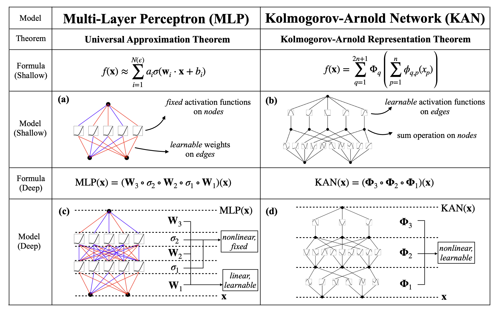
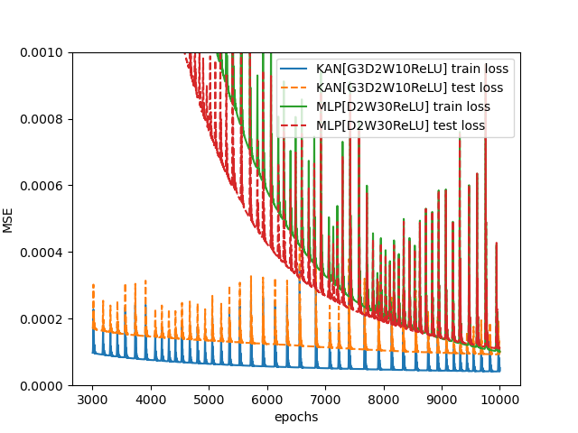
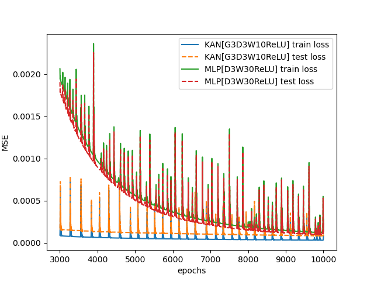

# KAN-DeepONet

In this repository, implementation of DeepONet based on Komogorov-Arnold Representation Theorem on 4 examples is available in 4 different folder named numerically 1,2,3,4.

## [KAN-DeepONet schematic figure will be added soon]

# Result

## [Example:1] Plot of KAN vs MLP based DeepONet when the depth of the branch and trunk net is 2:

## [Example:1] Plot of KAN vs MLP based DeepONet when the depth of the branch and trunk net is 3:

From the above 2 plot, one strange thing can be noticed. In case of MLP, test loss is less than train loss which is quite strange(this might not always be the case). 
